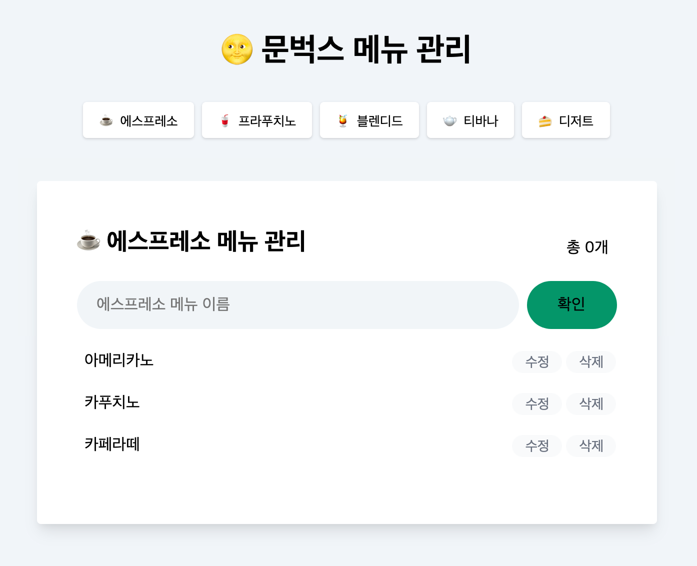

<br/>

<h2 align="middle">JS 스타벅스 카페메뉴 앱</h2>
<p align="middle">Vanilla JS로 구현 하는 상태관리가 가능한 카페메뉴 앱</p>
<p align="middle">
  
  
  
  
</p>

## 🔥 Projects!

<p align="middle">
  
</p>

<p align="middle">
  <a href="https://blackcoffee-study.github.io/moonbucks-menu/">🖥️ 데모 링크</a>
</p>

<br/>

## 🎯 step1 - 돔 조작과 이벤트 핸들링으로 메뉴 관리하기

- [x] 에스프레소 메뉴에 새로운 메뉴를 확인 버튼 또는 엔터키 입력으로 추가한다.
  - [x] 메뉴가 추가되고 나면, input은 빈 값으로 초기화한다.
  - [x] 사용자 입력값이 빈 값이라면 추가되지 않는다.
- [x] 메뉴의 수정 버튼을 눌러 메뉴 이름 수정할 수 있다.
  - [x] 메뉴 수정시 브라우저에서 제공하는 `prompt` 인터페이스를 활용한다.
- [x] 메뉴 삭제 버튼을 이용하여 메뉴 삭제할 수 있다.
  - [x] 메뉴 삭제시 브라우저에서 제공하는 `confirm` 인터페이스를 활용한다.
- [x] 총 메뉴 갯수를 count하여 상단에 보여준다.


## 🎯 step2 - 상태 관리로 메뉴 관리하기

- [x] [localStorage](https://developer.mozilla.org/ko/docs/Web/API/Window/localStorage)에 데이터를 저장하여 새로고침해도 데이터가 남아있게 한다.
- [x] 에스프레소, 프라푸치노, 블렌디드, 티바나, 디저트 각각의 종류별로 메뉴판을 관리할 수 있게 만든다.
- [x] 페이지에 최초로 접근할 때는 에스프레소 메뉴가 먼저 보이게 한다.


## 🎯 step3 요구사항 - 서버와의 통신을 통해 메뉴 관리하기

- [ ] [링크](https://github.com/blackcoffee-study/moonbucks-menu-server)에 있는 웹 서버 저장소를 clone하여 로컬에서 웹 서버를 실행시킨다.
- [ ] 웹 서버를 띄워서 실제 서버에 데이터의 변경을 저장하는 형태로 리팩터링한다.
  - [ ] localStorage에 저장하는 로직은 지운다.
  - [ ] fetch 비동기 api를 사용하는 부분을 async await을 사용하여 구현한다.
  - [ ] API 통신이 실패하는 경우에 대해 사용자가 알 수 있게 [alert](https://developer.mozilla.org/ko/docs/Web/API/Window/alert)으로 예외처리를 진행한다.
- [ ] 중복되는 메뉴는 추가할 수 없다.

## 📝 API

### baseUrl

`http://localhost:3000`

### 메뉴 생성하기

| method | uri                          |
| ------ | ---------------------------- |
| POST   | /api/category/:category/menu |

```javascript
{
 requestBody: {
   "name": "string"
 },
 response: {
   "id": "string",
   "name": "string",
   "isSoldOut": Boolean
  }
}
```

### 카테고리별 메뉴리스트 불러오기

| method | uri                          |
| ------ | ---------------------------- |
| GET    | /api/category/:category/menu |

```javascript
{
  response: [
    {
      id: "string",
      name: "string",
      isSoldOut: Boolean,
    },
  ];
}
```

### 메뉴 이름 수정하기

| method | uri                                  |
| ------ | ------------------------------------ |
| PUT    | /api/category/:category/menu/:menuId |

```javascript
{
 requestBody: {
   "name": "string"
 },
 response: {
   "id": "string",
   "name": "string",
   "isSoldOut": Boolean
  }
}
```

### 메뉴 품절 처리하기

| method | uri                                          |
| ------ | -------------------------------------------- |
| PUT    | /api/category/:category/menu/:menuId/soldout |

```javascript
{
 response: {
   "id": "string",
   "name": "string",
   "isSoldOut": Boolean
  }
}
```

### 메뉴 삭제하기

| method | uri                                  |
| ------ | ------------------------------------ |
| DELETE | /api/category/:category/menu/:menuId |

```javascript
응답 데이터 없음
```

<br/>

